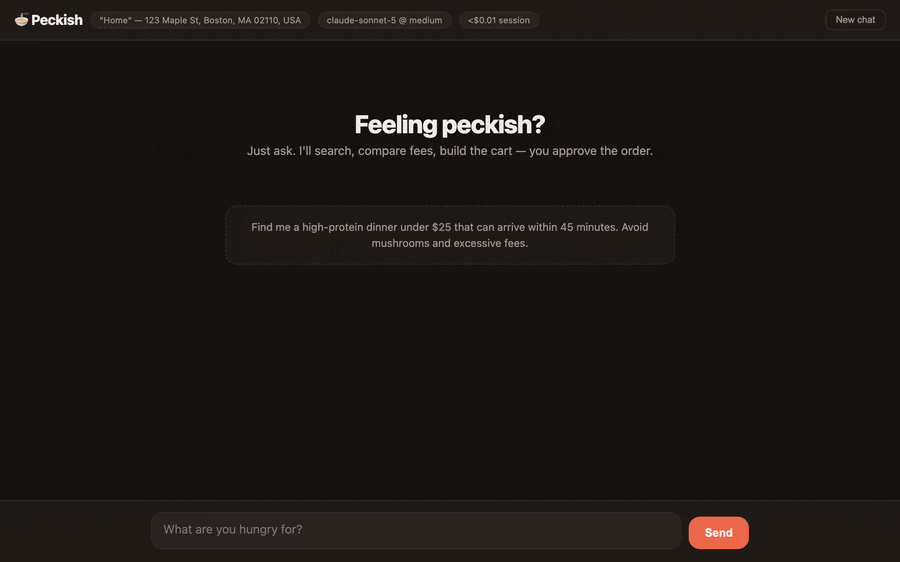

# Peckish 🍜

**Feeling peckish? Just ask.** An AI ordering agent for DoorDash — it searches,
compares real totals (fees included), builds the cart, and *you* approve every
order. Built on [Claude](https://platform.claude.com) and DoorDash's official
[`dd-cli`](https://github.com/doordash-oss/doordash-cli).

One tool layer, three surfaces:

| Surface | Start | Best for |
|---|---|---|
| **Terminal chat** | `peckish` | Living in the terminal |
| **Local web app** | `peckish-web` → http://localhost:4747 | Consumer-friendly UI: store cards, live quote, Stop button, order modal |
| **MCP server** | `claude mcp add peckish -- npx -y peckish-mcp`, or the double-click [`.mcpb`](https://github.com/CydVilla/peckish/releases/latest) | Claude Desktop / Claude Code users — **no API key needed**; your Claude subscription powers the model |

**Which one is for me?**

- **Comfortable with a terminal?** → Terminal chat. Fastest, most informative.
- **Want something that feels like an app?** → Local web app. Cards, live
  quote, a proper Place-order button.
- **Already use Claude Desktop or Claude Code?** → MCP server. No API key,
  no separate chat window — Claude itself becomes your ordering agent, and
  order confirmation appears as a native dialog.

<p align="center">
  
  <br>
  <em><sub>Scripted demo of the web app — store, prices and card are fictional;
  the interface and the approval gate are the real ones.</sub></em>
</p>

**[peckish on the web →](https://cydvilla.github.io/peckish/)**

**Updates:** every release ships with full notes, all artifacts, and a
`SHA256SUMS.txt` on [Releases](https://github.com/CydVilla/peckish/releases) —
see [CHANGELOG.md](CHANGELOG.md) for the history. Watch the repo (Releases
only) to get notified.

Install in one line — no git clone:

```sh
npm install -g peckish
```

**Prefer an app?** Download the
[Mac app (.dmg)](https://github.com/CydVilla/peckish/releases/latest) —
guided setup, no terminal at any step. See [Mac app](#mac-app) below.
Everything runs on your own machine either way, because dd-cli holds your
DoorDash session there — a Mac (Apple Silicon) or Linux x86_64, including
containers and cloud sandboxes: see
[Linux, containers and headless hosts](#linux-containers-and-headless-hosts).

```
you › Find me a high-protein dinner under $25 that can arrive within 45
      minutes. Avoid mushrooms and excessive fees.

⚙ search_restaurants {"query":"grilled chicken bowls","limit":8}  ✓ 2.1s
⚙ get_menu {"store_id":"35406455","filter":"chicken"}             ✓ 1.8s
⚙ list_carts {"store_id":"35406455"}                              ✓ 1.2s
⚙ add_items_to_cart {…}                                           ✓ 2.4s
⚙ preview_order {"cart_uuid":"…"}                                 ✓ 3.9s

Best fit: Sharon Korean Kitchen (4.8★, ~24 min) — Grilled Chicken Bulgogi
Bowl, $16.95. No mushrooms listed. Total with fees: $21.40 on your Visa
ending 1234. Suggested Dasher tip is $3.50 — that, another amount, or none?
~$0.04 turn · $0.04 session
```

---

## Get started (user guide)

### 1. Prerequisites

- **A Mac with Apple Silicon** (M1–M4) **or Linux x86_64** — the two platforms
  dd-cli publishes builds for. Peckish is local-first: whichever machine you
  run it on is the backend on every surface, because that's where dd-cli holds
  your DoorDash session.
- **Node.js 20+** — `node --version` to check; install from nodejs.org or brew.
- **DoorDash CLI access** (currently waitlist-gated by DoorDash). Peckish
  0.4.0 requires **dd-cli ≥ 0.2.1** — on Linux, **≥ 0.2.2**, the first release
  with Linux builds. Download the release from
  [doordash-oss/doordash-cli](https://github.com/doordash-oss/doordash-cli/releases),
  **verify the SHA256 checksum against the published value**, then:
  ```sh
  # macOS (Apple Silicon)
  tar -xzf dd-cli-v*-darwin-arm64.tar.gz && cd dd-cli-v*-darwin-arm64
  # Linux (x86_64)
  tar -xzf dd-cli-v*-linux-amd64.tar.gz && cd dd-cli-v*-linux-amd64

  bash install.sh          # both platforms — installs to ~/.local/bin/dd-cli
  dd-cli login             # sign in to DoorDash in your browser
  ```
  No browser on that machine (container, VM, cloud sandbox)? See
  [Linux, containers and headless hosts](#linux-containers-and-headless-hosts).
- **An Anthropic API key** for the terminal/web surfaces
  ([console.anthropic.com](https://console.anthropic.com)) — *or skip the key
  entirely and use the MCP surface with your Claude subscription (step 4).*

### 2. Install Peckish

```sh
npm install -g peckish
```

That's it — you now have three commands: `peckish` (terminal chat),
`peckish-web` (web app), and `peckish-mcp` (MCP server).

<details>
<summary>Or install from source (contributors)</summary>

```sh
git clone https://github.com/CydVilla/peckish.git
cd peckish
npm install
npm test          # optional: 25 unit tests, no network needed
npm run dev       # terminal chat (or: npm run web / npm run mcp)
```

</details>

### 3. Run it — terminal or web

```sh
export ANTHROPIC_API_KEY=sk-ant-…   # from console.anthropic.com

peckish         # terminal chat
peckish-web     # web app → open http://localhost:4747
```

On boot Peckish verifies your DoorDash sign-in, shows your default delivery
address, and flags any open carts you forgot about. If sign-in is missing or
expired, Peckish offers to fix it for you: the terminal asks before launching
`dd-cli login` (which opens your browser), the web app shows a sign-in card,
and mid-conversation the agent can offer the same assist on any surface — you
approve, sign in in the browser, and it picks up where it left off. On a
machine with no browser, Peckish skips that offer and tells you how to inject
a token instead — see below.

### 4. Or run it inside Claude — no API key

Claude itself becomes the ordering agent, and your Claude subscription pays for
the model. Pick whichever fits your client:

**Claude Code** — one line:

```sh
claude mcp add peckish -- npx -y peckish-mcp
```

**Claude Desktop** — download `peckish-0.2.2.mcpb` from
[Releases](https://github.com/CydVilla/peckish/releases/latest) and
double-click it. Claude Desktop installs it like a browser extension: no
terminal, no Node install, no JSON editing.

<details>
<summary>Or configure Claude Desktop by hand</summary>

Add to `~/Library/Application Support/Claude/claude_desktop_config.json`:

```json
{
  "mcpServers": {
    "peckish": {
      "command": "npx",
      "args": ["-y", "peckish-mcp"]
    }
  }
}
```

If dd-cli isn't at `~/.local/bin/dd-cli`, add
`"env": { "DD_CLI_PATH": "/your/path/to/dd-cli" }` — desktop apps don't
inherit your shell `PATH`.

</details>

Peckish is also listed in the [MCP Registry](https://registry.modelcontextprotocol.io)
as `io.github.CydVilla/peckish`, so clients that browse the registry can find
it directly.

Restart Claude Desktop and ask it to find you dinner. Order confirmation
appears as a native dialog; clients that can't render dialogs can browse and
build carts but **cannot place orders** (fail closed).

### 5. Everyday use

Things to say:

- *"Find me a high-protein dinner under $25 that can arrive within 45 minutes. Avoid mushrooms and excessive fees."*
- *"Compare the real totals at the top two — fees included."*
- *"Reorder my usual from Sharon Korean."*
- *"What did I spend on delivery last month?"*
- *"Is this place actually good?"* (checks web reviews)
- *"Never mushrooms, ever."* → saved permanently; applied automatically next time
- *"Get me milk, eggs, and a pound of ground beef from Whole Foods."*

**Placing an order** always ends with an explicit confirmation *you* perform —
typing `yes` in the terminal, clicking **Place order** in the web modal, or
approving the dialog in Claude Desktop. Before that, Peckish must show you the
itemized quote, confirm the tip, and name the card being charged. Decline
anything and it backs off.

**Controls & housekeeping**

| Where | What |
|---|---|
| Terminal | `/prefs` saved preferences · `/cost` session spend · `/reset` new conversation · `/quit` · **Ctrl+C stops a running turn** |
| Web | **Stop** button cancels a turn · **New chat** resets · header chip shows session cost · click the **address chip** to switch your delivery address (editing an address's text happens on doordash.com — Peckish picks it up automatically) |
| Both | Preferences live in `~/.peckish/preferences.json`; a full audit log of every tool call and confirmation is written to `~/.peckish/logs/*.jsonl` |

**Cost:** defaults are tuned for low spend at decent quality — `claude-sonnet-5`
at medium effort, prompt caching on the system prefix and conversation tail,
and server-side context editing that prunes stale menu payloads in long
sessions. The cost meter shows the approximate spend per turn and per session.
Max quality: `DD_AGENT_MODEL=claude-opus-4-8 DD_AGENT_EFFORT=high`. (On MCP,
the client chooses and pays for the model.)

**Troubleshooting**

| Symptom | Fix |
|---|---|
| `DoorDash sign-in is missing or expired` | Accept the built-in sign-in assist (it runs `dd-cli login` for you), or run it in a terminal yourself |
| The same, on a headless Linux box | There's no browser to sign in with: `dd-cli export-token` on a machine that has one, then `DD_CLI_ACCESS_TOKEN=…` here ([details](#linux-containers-and-headless-hosts)) |
| Auth errors right after upgrading dd-cli | New CLI versions can need fresh scopes — sign in again (assist, `dd-cli login`, or a fresh `export-token`) |
| `Anthropic authentication failed` | `export ANTHROPIC_API_KEY=…` in the same shell, restart |
| `dd-cli binary not found` | Install dd-cli (step 1) or set `DD_CLI_PATH=/path/to/dd-cli` |
| `no dd-cli build` for your machine | dd-cli ships macOS arm64 and Linux x86_64 only — Intel Macs and Linux arm64 can't run Peckish |
| Web app port in use | `PECKISH_PORT=5757 peckish-web` |
| A turn ran away | Ctrl+C (terminal) / Stop (web) — history rolls back cleanly |

Env vars: `DD_AGENT_MODEL` (default `claude-sonnet-5`), `DD_AGENT_EFFORT`
(`low`–`max`, default `medium`), `DD_CLI_PATH`, `PECKISH_PORT` (default `4747`),
`DD_CLI_ACCESS_TOKEN` (read by dd-cli itself — browserless sign-in).

---

## Mac app

A double-clickable app for people who never want to see a terminal:
download `Peckish-x.y.z-arm64.dmg` from
[Releases](https://github.com/CydVilla/peckish/releases/latest), drag
**Peckish** to Applications, and open it.

**First launch (Gatekeeper):** the app is ad-hoc signed but not notarized (no
paid Apple Developer ID), so macOS won't open it on a plain double-click the
first time. **Right-click the app → "Open" → "Open"** (or approve it under
System Settings → Privacy & Security). Only needed once.

> If macOS instead says **"Peckish is damaged and can't be opened"**, you have
> a build from before this was fixed, or the download quarantine got confused.
> Clear it once and it opens normally:
> ```sh
> xattr -cr /Applications/Peckish.app
> ```

First-run setup happens in the app — three buttons, no terminal:

1. **DoorDash CLI** — one-click guided install (downloads the official
   release, verifies its SHA256 checksum before running anything). If you
   don't have dd-cli access yet, there's a waitlist link.
2. **Sign in to DoorDash** — opens your browser; the app detects when
   you're done. Your sign-in lives in the macOS keychain.
3. **Anthropic API key** — paste it once; it's stored encrypted with
   Electron `safeStorage` (keychain-backed), never in plain text.

Then **Open Peckish** — same web app, same order-confirmation modal, same
safety gates; the app is just a shell that runs the local server for you on
a random localhost-only port. Requires Apple Silicon; Node.js is **not**
required (the app bundles its own runtime).

Building it yourself: `cd desktop && npm install && npm run dist` →
`desktop/dist/Peckish-*.dmg`.

The `.dmg` is the one Mac-only surface. The terminal, web and MCP surfaces all
run on Linux too:

---

## Linux, containers and headless hosts

dd-cli **v0.2.2** added Linux (amd64) builds, so all three Peckish surfaces run
on Linux x86_64 unchanged — same tools, same order gate, same audit log.
Install dd-cli from the same release page (asset
`dd-cli-v<version>-linux-amd64.tar.gz`, verify its SHA256, `bash install.sh`),
then `npm install -g peckish`. If you put the binary somewhere other than
`~/.local/bin/dd-cli`, set `DD_CLI_PATH` — Peckish also checks
`/usr/local/bin/dd-cli` and your `PATH`.

**With a desktop session** (`DISPLAY` or `WAYLAND_DISPLAY` set), nothing
changes: `dd-cli login` opens your browser and the built-in sign-in assist
works exactly as it does on a Mac.

**Without one** — a container, a VM, a cloud sandbox, SSH with no forwarding —
the browser flow cannot complete, so Peckish stops offering it (no spawned
login that hangs forever, no "run `dd-cli login`" advice that can't work) and
points at the token path instead:

```sh
# 1. on a machine that HAS a browser (dd-cli ≥ 0.2.2)
dd-cli export-token

# 2. in the environment that runs Peckish
export DD_CLI_ACCESS_TOKEN='<the token>'
peckish            # or peckish-web / peckish-mcp
```

dd-cli picks the token up from the environment Peckish passes down, so every
surface authenticates without a keychain or a browser.

- **That token is live access to your DoorDash account** — it can place real
  orders. Treat it like a password: keep it in your runtime's secret store, not
  in an image layer, a `docker run -e` in your shell history, or a committed
  `.env`. Mint a fresh one with `dd-cli export-token` when it expires.
- **The order gate does not change.** Placing an order still needs your
  explicit approval on the surface you're using (typed `yes`, the web modal, or
  the MCP dialog) — headless means no browser, not unattended ordering.
- **`peckish-web` in a container** binds `127.0.0.1` *inside the container* by
  design, so a published port (`-p 4747:4747`) can't reach it. Run the
  container with `--network host` (Linux), or use the terminal or MCP surface,
  which need no port at all.
- **Not supported:** Linux arm64 and Intel Macs — dd-cli publishes no build for
  either, and Peckish says so explicitly instead of failing obscurely.

---

## What it does

- **Search → menus → cart → preview → confirm → submit**, with the real
  fee/ETA quote (`order preview`) driving every recommendation.
- **Comparison shopping**: builds carts at up to 3 finalists, compares true
  totals + fee share + ETA, recommends one, deletes the losers.
- **Fee tactics**: promo scanning with consent, pickup-vs-delivery comparison,
  DoorDash credits surfaced, DashPass status shown.
- **Memory**: dietary rules and habits persist across sessions and surfaces.
- **History**: "my usual" from order frequency, honest spend breakdowns from
  receipts, reorders with silent-drop detection.
- **Web reviews** via Claude's server-side web search (never used for prices —
  dd-cli is the only source of truth for ordering data).
- **Group carts** (new in 0.4.0): "start a group order for the team, $25 each" —
  creates a shareable cart link, optional per-person spend limit, host reviews
  and submits when everyone's in.
- **Express delivery** (new): asks for Priority when you want it fastest —
  offered per-cart, priced into the quote before you approve.
- **Credits control** (new): DoorDash credits apply by default; say "don't use
  my credits" to opt out for an order.
- **Enterprise chains** (new): Domino's, Sweetgreen, Dave's Hot Chicken and
  other big chains are now orderable (dd-cli ≥ 0.2.1).
- Work benefits (company budgets + expense codes), scheduled delivery,
  pickup, groceries/retail/pets/alcohol.

## Architecture

```
terminal REPL          local web app           MCP client (Claude Desktop…)
 src/index.ts           src/web.ts + public/    src/mcp.ts
      └────────────┬─────────┘                       │  (client's model reasons;
                   ↓                                 │   server instructions guide it)
     Claude agent loop, streaming                    │
     src/agent.ts · claude-sonnet-5 · strict tools   │
     · adaptive thinking · context editing           │
     · prompt caching · web_search · cost meter      │
                   └───────────────┬─────────────────┘
                                   ↓
                 28 typed tools — src/tools.ts (strict: true)
                                   ↓
                 sanitizing wrapper — src/ddcli.ts
                                   ↓
                 dd-cli --json-output  →  DoorDash
```

## Safety model

Placing an order **always requires an explicit human approval rendered by the
surface, not by the model**:

| Surface | The gate |
|---|---|
| Terminal | Type `yes` at a prompt |
| Web | "Place order" modal (declines automatically after 5 min) |
| MCP | Client elicitation dialog; clients without elicitation **cannot place orders** (fail closed) |

Also on every surface:

- **Strict tool schemas** — the API guarantees tool arguments validate before
  any handler runs (no malformed-argument class).
- **Abortable turns** — Ctrl+C / Stop rolls history back to the turn start.
- **Audit log** — every tool call, argument set, duration, confirmation
  outcome, and submit result in `~/.peckish/logs/*.jsonl`.
- Tip confirmed + card named before any submit ask; submit never auto-retries
  (not idempotent); success reported only after `order status` confirms.
- Merchant text treated as data (widget/assistant-instruction fields stripped);
  read-only CLI calls retry once on transient errors, mutations never do.
- Web server is localhost-only (Host + Origin checks).

## What Peckish shares with DoorDash

dd-cli ≥ 0.2.1 requires an `--intent` note on every command, which DoorDash
says it may review for research and product improvement. DoorDash's documented
format asks for your **verbatim prompt** — but food prompts routinely contain
dietary, health, and religious signals, which DoorDash's own guidance says to
avoid. So Peckish defaults to privacy:

- **What is sent:** a one-line goal summary authored by the model at generic
  altitude (e.g. `Summary: Help the user order dinner`), plus an explicit
  `user prompt/purpose: "(not shared — Peckish privacy default)"` marker.
- **What is never sent by default:** your verbatim words, dietary rules,
  budgets, names, saved preferences, or conversation content.
- **Opt in to the full format:** set `PECKISH_INTENT_VERBATIM=1` and the
  intent will include your opening request verbatim, as DoorDash's docs ask.

Independent of intent, DoorDash necessarily sees the API traffic itself
(searches, carts, orders) — that's inherent to ordering.

## Repo map

| File | What it is |
|---|---|
| `src/index.ts` | Terminal REPL surface (abort, cost lines, /cost) |
| `src/web.ts` + `public/index.html` | Web surface: SSE streaming, cards, Stop, confirm modal, Origin guard |
| `src/mcp.ts` | MCP stdio server: 28 tools + session context, instructions, elicitation gates |
| `src/agent.ts` | System prompt + streaming tool loop (beta: context editing; web_search; usage) |
| `src/tools.ts` | Tool schemas (strictified) + handlers; menu trimming/filtering |
| `src/ddcli.ts` | `execFile` wrapper: envelope parsing, UI-field stripping, error mapping, bounded read-only retry |
| `src/platform.ts` | Supported dd-cli targets + whether sign-in can use a browser here or needs an injected token |
| `src/confirm.ts` | Pluggable confirmation gates (fail closed) |
| `src/costs.ts` / `src/logger.ts` | Cost accounting · JSONL audit log |
| `src/prefs.ts` | Preference persistence (`~/.peckish/`) |
| `tests/unit.test.ts` | 25 unit tests (`npm test`), no network needed |
| `desktop/` | Electron shell for the Mac app (.dmg): onboarding + server launcher, no agent logic |
| `packages/mcp/` | The `peckish-mcp` npm package — a launcher so `npx -y peckish-mcp` starts the MCP server |
| `extension/` | Claude Desktop extension (`.mcpb`): manifest + vendored server. `node build-manifest.mjs && mcpb pack . peckish.mcpb` |
| `server.json` | MCP Registry metadata (`io.github.cydvilla/peckish`) |

## Releasing

Everything ships from one tag. `.github/workflows/release.yml` publishes both
npm packages, registers the MCP Registry entry, builds the `.mcpb` and the
`.dmg`, and attaches both to the GitHub release:

```sh
npm version patch          # or edit the versions by hand
git push && git push --tags
```

Every publish step is **skip-if-already-published**, so re-running a tag after a
failure is safe. `.github/workflows/ci.yml` runs typecheck, tests, a metadata
consistency check, and a real MCP handshake on every push.

`scripts/check-consistency.mjs` guards the metadata that spans files and drifts
silently — the registry namespace casing, matching `server.json` name and
`mcpName`, the 100-character registry description cap, and the extension's
advertised tool list. Run it locally before tagging.

<details>
<summary>One-time setup for the automation</summary>

**npm** — either configure
[trusted publishing](https://docs.npmjs.com/trusted-publishers) on npmjs.com for
both `peckish` and `peckish-mcp` (provider: GitHub Actions, repo
`CydVilla/peckish`, workflow `release.yml`) so no secret is needed, **or** add an
`NPM_TOKEN` repository secret using a granular access token with "bypass 2FA"
enabled.

**MCP Registry** — nothing to configure. The workflow authenticates with
`mcp-publisher login github-oidc`, and GitHub's OIDC token proves the repo owner
is `CydVilla`, which grants the `io.github.CydVilla/*` namespace.

**Mac app signing** — the `.dmg` is built unsigned. Notarized builds would need
an Apple Developer ID plus `CSC_LINK`/`CSC_KEY_PASSWORD` and notarization
secrets.

</details>

## Notes & limitations

- Local-first by design: hosted delivery (SMS bots, voice) would require
  DoorDash's partner API — your own machine is the backend here.
- One open cart per store (DoorDash rule) — Peckish collision-checks and asks.
- `payment-method list` sees cards only; wallet defaults (Apple Pay etc.) are
  confirmed generically or via the browser checkout URL.
- Age-restricted items can't be submitted by an agent — checkout URL fallback.
- Popularity data is deliberately unused (per dd-cli guidance); web reviews
  fill that gap with attribution.
- Cost figures are close estimates from token usage at list prices.
